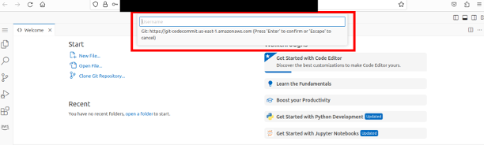

# Accessing CodeCommit Credentials and Configuring Git for Your Team

This guide outlines the steps for team members to obtain AWS CodeCommit credentials and set up Git in your SageMaker Studio for interacting with your team's CodeCommit repository. If you require further assistance or experience any difficulties during this process, do not hesitate to contact us at APL-DTC-Help@jhuapl.edu for support.

## Obtaining Git CodeCommit Credentials

The AWS Secrets Manager securely stores your team's CodeCommit credentials. To access your credentials, you can use the AWS Command Line Interface (CLI) from your SageMaker (or Workspace) terminal. It's important to note that access is restricted to your own team's credentials, ensuring each team member can only retrieve their respective credentials. However, this setup also ensures that every team member has the capability to securely access their team's CodeCommit credentials.

To retrieve your CodeCommit credentials, replace {team_tag} with your actual team name and execute the following command:

```bash
aws secretsmanager get-secret-value --secret-id {team_tag}/codecommit
```

Executing this command will produce a JSON object containing your credentials. To locate your username and password, search for the `SecretString` field within the JSON output.

Should you encounter the error message No such file or directory: 'less', this issue can be resolved by installing the less package. Run the following command to install less:

```bash
sudo apt-get install less
```

## Configuring Git

We recommend configuring your Git name, email and cache settings before cloning. 

First, configure Git with your name and email. Replace Your Name and your_email@example.com with your actual name and email:

```bash
git config --global user.name "Your Name"
git config --global user.email "your_email@example.com"
```

To avoid entering your credentials every time you interact with your CodeCommit repository, you can use Git's credential caching feature. First, ensure you have the AWS CLI installed and configured on your machine.

Then, execute the following command to cache your credentials for a specified time (in seconds). For example, to cache credentials for 2 hours (7200 seconds):

```
git config --global credential.helper 'cache --timeout=7200'
```

## Repository Access

All teams are provided one repository. Contact us if you'd like to set up more repositories for your team. You should be able to access your team's repository outside AWS. You can use the same CodeCommit credentials.

### Your Team's Repository Name
Your CodeCommit repository is set up under the name `{team_tag}`, where `{team_tag}` should be replaced with your team tag.

You can clone it with the following command: 

```bash
git clone https://git-codecommit.us-east-1.amazonaws.com/v1/repos/{team_tag}
```

When you first push to or pull from your CodeCommit repository, Git will prompt you for your username and password. Enter the credentials obtained from AWS Secrets Manager.

Note: For CodeEditor, you will be prompted to use your provided Git username and password at the top of the browser.



## AWS DTC CodeCommit Repository Management  

This guide provides steps to create and manage AWS CodeCommit repositories in the DTC AWS account using the AWS Command Line Interface (CLI). Participants may use their DTC credentials to create CodeCommit repositories on their local machines, SageMaker, or WorkSpace. New repositories have two requirements:

- The name of the repository must be prefixed by your team's tag separated by a dash. 
- The repository must be tagged with key `dtc-team` set to your team's tag. 

*Example* 
Assuming my team was `apl-lima`, I can create a repository called `apl-lima-lib` with the resource tag `dtc-team=apl-lima`. 
I would NOT be able to create a repository with name `apl-foxtrot` or `apl-limaScratch` since they do not match the `{team-tag}-` pattern. 

### Creating a Repository with Specific Name Prefix and Tag

To create a repository that has a team prefix in the name and includes a tag, use the following command:

```bash
aws codecommit create-repository --repository-name <team-tag>-<repo-name> --repository-description "Repository for project" --tags 'Key=dtc-team,Value=<team-tag>'
```

#### Parameters:
- `--repository-name`: Name of the repository to create. Must include the required prefix, e.g., "dtc-".
- `--repository-description`: A description for the repository.
- `--tags`: Key-value pairs to tag the repository.

### Common CodeCommit Commands

#### Get Repository Details
To get detailed information about a specific repository:

```bash
aws codecommit get-repository --repository-name <team-tag>-<repo-name> 
```

#### Delete a Repository
To delete a repository:

```bash
aws codecommit delete-repository --repository-name <team-tag>-<repo-name> 
```

#### List Repositories
We do not provide permissions to users to list repositories. If you would like to get a report or status of one or more of your teams repositories, please contact APL-DTC-Help@jhuapl.edu.


### More info

More info about CodeCommit available in the [official AWS Docs](https://docs.aws.amazon.com/codecommit/latest/userguide/how-to-create-repository.html).
