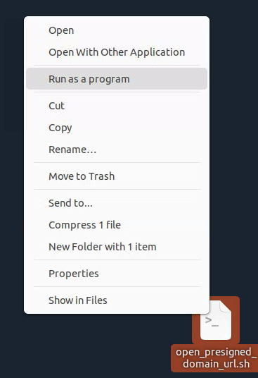
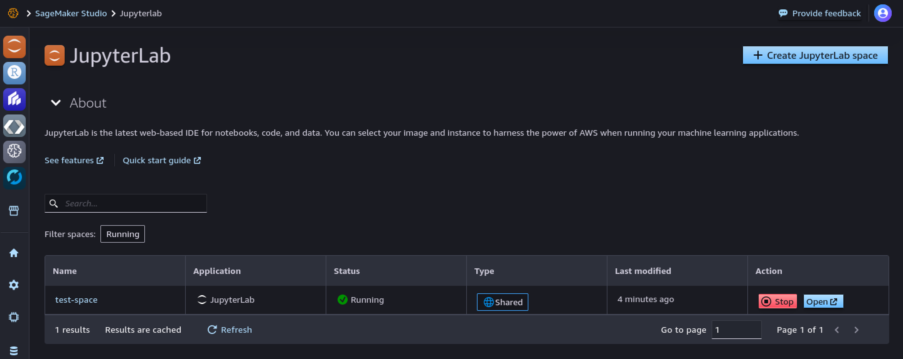
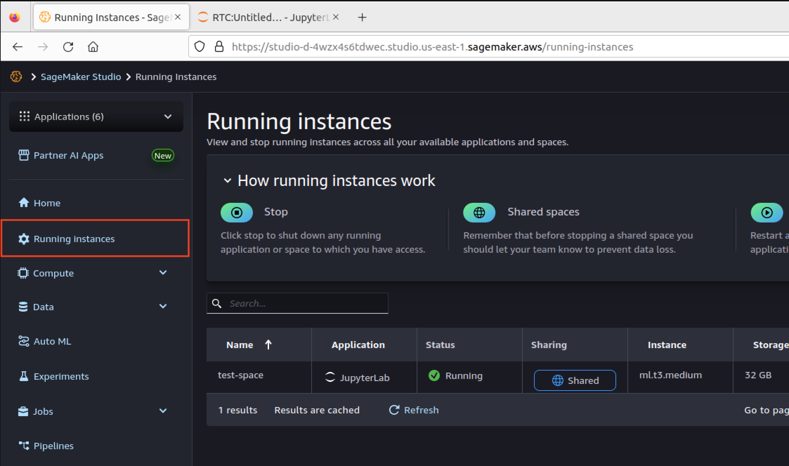

# DTC Participant AWS User Guide

This user guide provides step-by-step instructions to configure your AWS WorkSpace and AWS SageMaker environment as well as troubleshooting notes for common issues. Contact the JHU APL team if you have any questions at APL-DTC-Help@jhuapl.edu.


## Table of Contents

- Tutorials
	- Configuring your WorkSpace
	- Connecting to your team's SageMaker Studio
	- Quick Start SageMaker Studio
	- Transfer data to and from S3 buckets

## Tutorials 
### Configuring your WorkSpace

AWS WorkSpace is a Desktop-As-A-Service platform that streams a virtualized desktop environment to your local machine. For this challenge, we use WorkSpaces to provide participants a pre-configured, secure environment to access DTC data and computing resources to develop their models. 

Currently, all participants will use the same WorkSpace bundle: Ubuntu 22.04 Power Bundle (4 vCPU, 16 GiB RAM) with the following pre-installed libraries and programs: FireFox, Python 3.9, VSCode, and MySQL WorkBench. We may change the default bundle or provide alternative bundles in the future. 

Once you are permitted to participate in the TA2 challenge, you should receive two emails contain information about accessing WorkSpaces and SageMaker domain. The WorkSpaces email will look similar to the one show below and contains the information you need to configure your WorkSpace.

>Dear Amazon WorkSpaces User,
>
>Your administrator has created an Amazon WorkSpace for you. Follow the steps below to quickly get started with your WorkSpace:
>
>1. Complete your user profile and download a WorkSpaces client using the following link: <URL>
>
>2. Launch the client and enter the following registration code: <REGISTRATION_CODE>
>
>3. Login with your newly created password. Your username is <USERNAME>
>
>You may download clients for additional devices at https://clients.amazonworkspaces.com/
>
>If you have any issues connecting to your WorkSpace, please contact your administrator.
>
>Sincerely,
>
>Amazon WorkSpaces 

Follow the steps below to finish setting up your WorkSpace.
1. Click the link for your user profile and create a password for your account. Account passwords can be reset by an administrator or through the client.


2. If you haven't already, download and install the WorkSpaces client at https://clients.amazonworkspaces.com/. The WorkSpaces client is compatible with most operating systems.

3. Open the WorkSpace client and input your registration code in the in the input box.


4. Log-in using the username from the WorkSpaces email and the password you created in Step 1. 


5. Once you successfully log-in, the client will expand to fill your screen and load your WorkSpace. On its first load, this may take a couple minutes to fully initialize. If you have a multi-monitor or high-resolution screen, the WorkSpace desktop may seem zoomed-out or cropped. Closing the client and re-logging in sometimes helps with this issue. If the issue persists, disable High-DPI mode in Settings -> Display Settings. 


That's it! A couple of additional points:
- The default WorkSpace supports "Paste-Only" clipboard redirect (using Ctrl+Shift+V in your WorkSpace). This means you can copy and paste things from your local workstation to the WorkSpace, but not the other way around.
- Your WorkSpace user will not have access as local administrator by default, but the user account is able to install user level libraries and packages. 
- Pre-installed applications such as FireFox, VSCode, and MySQL WorkBench can be found in the Applications library, which can be opened by clicking "Show Applications".
- WorkSpaces will shut down after an hour of inactivity.

### Connecting to your team's SageMaker Studio

SageMaker Studio is a web-based IDE, similar to JupyterLab, that enables you run code on AWS instances. Each team is provided a SageMaker domain, and individual users are provided user profiles. Each user profile has an *Elastic File Store* within their profile to store files. When creating a kernel or running arbitrary code, SageMaker studio will prompt you to create an instance from an image. Instances define the hardware specifications and images define the software specifications. To access SageMaker Studio, we provided you a set-up script that will create a log-in application within your WorkSpace (i.e., `open_presigned_domain_url.sh`). The instructions below allows you to configure your WorkSpace to generate this log-in application.

You should receive two emails containing information about the WorkSpace and SageMaker domain. The SageMaker domain email will look similar to the one show below and contains the information you need to connect to SageMaker. **You will need to first set up your WorkSpace before proceeding to connect to SageMaker.**

>Dear User,
>
>Below is your SageMaker Studio log-in details. Please contact APL-DTC-Help@jhuapl.edu if you have any questions.
>
>AWS Access Key: **<USER_AWS_ACCESS_KEY>**
>
>AWS Secret Key: **<USER_AWS_SECRET_KEY>**
>
>Studio Domain ID: **<TEAM_DOMAIN_ID>**
>
>User Profile: **<USER_PROFILE_NAME>**

Follow the steps below to configure your WorkSpaces to connect to your SageMaker Studio. You will only need to configure your SageMaker Studio once. After initial configuration, you can use the generated launch script to reconnect to your SageMaker studio. 

1. Connect to your Ubuntu WorkSpace using the AWS WorkSpace client.

2. Open a terminal window and run the following command to configure your AWS credentials. These credentials are shared by your team and allow you to create pre-signed URLs to your team's SageMaker domain.

	`aws configure`

	The CLI will then prompt you to input your AWS Access key (i.e., `<USER_AWS_ACCESS_KEY>`) and secret key (i.e., `<USER_AWS_SECRET_KEY>`), which can be copied directly from the set-up email. Set the default region to `us-east-1` and leave the default output format empty. 

3. Each WorkSpace comes pre-loaded with a set-up script named `dtc-setup.sh`. This script creates a launch script, `open_presigned_domain_url.sh`, that when ran will generate an authenticated URL and open it on the default browser. To use the script, open a terminal and run the `dtc-setup.sh` and replace the arguments with your own values for domain ID and user profile name from the set-up email:

	`dtc-setup.sh <TEAM_DOMAIN_ID> <USER_PROFILE_NAME>`


You'll know the script ran successfully when there is a new file on your desktop named `open_presigned_domain_url.sh`. 

4. Launch the script directly from the Desktop by right-clicking it and clicking "Run as Program". Alternatively, you can run it from the terminal.



Running the launch script should open a new tab or window on your browser and load SageMaker Studio default page. 


A few important things to consider when using SageMaker instances:    
- DARPA provided each team a budget to maintain the team’s infrastructure, perform analysis, and develop models. Please use your resources judiciously and efficiently!   
- SageMaker instances will continually accrue expenses so long as they are active. We strongly advise that you shut down any unused or idle instances to avoid accruing unwanted costs. See [SageMaker Instances](SageMaker%20Instances.md) for available instances and their associated rates. These rates are subject to change.   
- APL will be sending weekly cost reports via email to inform you of the status of your weekly/total cost accrual and resource usage statistics.  
  

### Quick Start SageMaker Studio

Using SageMaker Studio tool, you will be able to access GPU resources to train and evaluate your models. We recommend that you go through the [AWS official documentation](https://docs.aws.amazon.com/sagemaker/latest/dg/studio-ui.html) to familiarize yourself with the tools available to you.

#### Quick Start 

1. Once you have SageMaker Studio loaded on your browser, select "Open Launcher" button.


2. Configure your python environment by selecting your Python image and SageMaker instance. 


Select your Python image:


Select your [SageMaker instance](SageMaker%20Instances.md):


Once selected click the "Select" button.

3. Instantiate a notebook


This will create a "Untitled.ipynb" file and begin instantiating the kernel with the selected Python image and SageMaker instance. This instantiation process may take a while as SageMaker is provisioning your environment with the necessary resources. You will encounter this notification:


4. Once the instantiation process is complete and you see this screen below, you may begin developing!


5. To shutdown a SageMaker instance, click on the "Running Instances" Icon (left side of the dashboard). 



Click on the "Power" button to turn off a specific instance:


### Transferring data to and from S3 buckets

Each user has access to 3 different storage types:

1. SageMaker Studio Elastic File System (EFS) for user private storage.
2. Team Scratch Bucket (S3 bucket) (`dtc-scratch-{team_name}`) for sharing with teams.
3. Read-only Training Dataset Bucket (S3 bucket) (`dtc-training-data`) for storing the official training dataset.

You can access your private storage within SageMaker Studio. To transfer files from the S3 buckets (i.e., Team Scratch and Training Dataset Bucket) you can either do so in your (1) terminal or (2) notebooks:

#### Transferring files using terminal:

1. Open SageMaker Studio's launcher and select "System Terminal":


In the terminal, you may use the [AWS CLI S3](https://docs.aws.amazon.com/cli/latest/reference/s3/) to run commands (e.g., `cp`, `ls`, `rm`, etc.).

2. To copy (`cp`) files from the scratch bucket to the into your (EFS) from you can use the command `aws s3 cp s3://dtc-scratch-{team_name}/path/to/file .`. To copy files into the scratch bucket from your EFS storage, you may use `aws s3 cp <filename> s3://dtc-scratch-{team_name}/path/`.

#### Transferring files using notebooks:

You man transfer files between storage containers using an array of python packages (e.g., `S3Fs`, `boto3`, etc.)

1. Create a notebook. In a cell, run:

```python
import s3fs
fs = s3fs.S3FileSystem()

# To List 5 files in your team scratch bucket
fs.ls('s3://dtc-scratch-{team_name}/')[:5]

# Open files directly
with fs.open('s3://dtc-scratch-{team_name}/test.txt') as f:
    print(f.read())

# Download files to EFS
fs.download('s3://dtc-scratch-{team_name}/filename', "test.txt")

# Upload files to S3 bucket
fs.upload("test.txt", 's3://dtc-scratch-{team_name}/test.txt')
```
