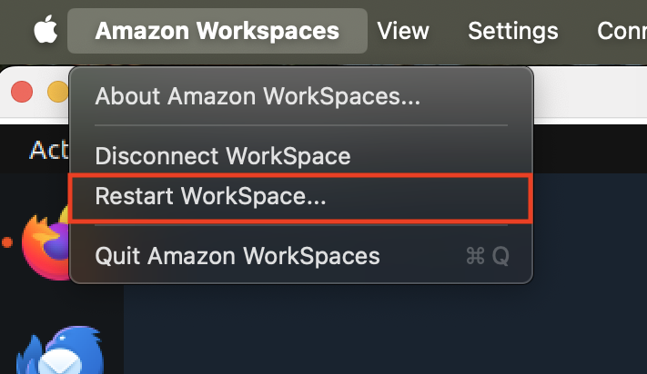
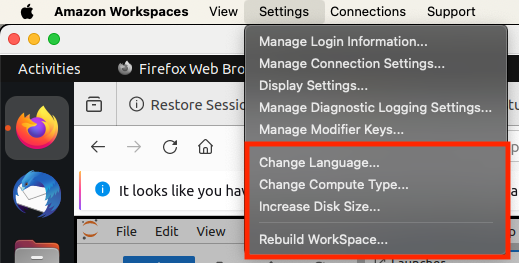

# AWS WorkSpaces Configuration

All participants have been provided with an AWS WorkSpace to facilitate SageMaker Access and local development in a streamed desktop environment. Initially, all WorkSpaces were provisioned as "Power" instances. We are pleased to announce that you now have the ability to self-service your WorkSpace configuration, including rebuilding, rebooting, and changing the compute type, directly from your WorkSpace client. This guide will walk you through the steps to manage your WorkSpace and explain any limitations in changing compute types.

## Accessing WorkSpace Management Features

To manage your workspace, launch the AWS WorkSpaces client application on your computer and log in with your credentials.

## Rebooting Your WorkSpace

If your WorkSpace becomes unresponsive or you need to restart it for any reason:   
  
1. Click on the "Amazon Workspaces" dropdown from within the client interface.  
2. From the dropdown options, select "Restart WorkSpace".   
3. Confirm the action to initiate the restart. The restart process will take several minutes.
2. Wait for a few minutes while your WorkSpace restarts. You might need to log-in again after restart.

## Rebuilding Your WorkSpace

Rebuilding restores your WorkSpace to its original state. This is usually a last-resort step when the workspace is unresponsive or unable to connect. **Important: This will erase all data and applications that are not saved on the user volume (D: drive).**

1. Click on the Settings dropdown from within the client interface.
2. From the self-service options, select "Rebuild WorkSpace". Read the warning message carefully.
3. Confirm the action to initiate the rebuild. The rebuild process may take up to 20 minutes.

## Changing Compute Type

You can change your WorkSpace to a different compute type to better suit your performance needs. **If your administrator recently created your WorkSpace, you must wait 6 hours before you can change your WorkSpace compute type. After that, you can switch to a larger compute type once in a 6-hour period, or to a smaller compute type once in a 30-day period.** 

1. From the self-service options, select "Change Compute Type".
2. Choose your desired compute type from the list of available options (see the table below for details). Confirm the change when prompted.
3. When your WorkSpace compute type change is in progress, you are disconnected from the WorkSpace. During this time, you can't use or make changes to the WorkSpace. This process might take up to an hour.

**Upgrading to a higher compute type may increase costs. Please review the [AWS pricing details](https://aws.amazon.com/workspaces-family/workspaces/pricing/) before making changes.**  

| Compute Type | vCPU | Memory (GB) | Root Volume (GB) | User Volume (GB) | Monthly Price (US East 1) |
|--------------|------|-------------|------------------|------------------|---------------------------|
| Value        | 1    | 2           | 80               | 10               | $25                      |
| Standard     | 2    | 4           | 80               | 50               | $35                      |
| Performance  | 2    | 7.5         | 80               | 100              | $60                      |
| Power        | 4    | 16          | 80               | 100              | $125                     |
| PowerPro     | 8    | 32          | 80               | 100              | $225                     |

**Note**: GPU WorkSpace bundles are available upon request.  
**Note**: Compute type cost information is subject to change. See the [AWS pricing details](https://aws.amazon.com/workspaces-family/workspaces/pricing/) for the most up-to-date compute type pricing details.
